# System design

## 1. Context and constraints

This feature changes Kapelle's own instruction, human-artifact, deterministic-validation, and test
surfaces. The public lightweight workflow and approval model are binding constraints. Human prose
must remain reviewable and proportional; runtime metadata remains under `_kapelle/`.

The first slice preserves the existing `progressive-map-v1` root headings. It strengthens the
active-slice substructure and lifecycle rather than introducing a second artifact format or a new
public command.

## 2. System boundaries and responsibilities

### Current architecture

- `references/progressive-artifacts.md` defines the durable product and system-design shapes.
- `references/artifact-presentation.md` defines human readability and final convergence.
- `skills/start`, `amend`, and `verify` author, evolve, and reconcile the package.
- `scripts/validate_progressive_docs.py` checks deterministic structure and size.
- Unit tests and `validate_plugin.py` guard compatibility and required protocol language.

### Resulting architecture

- The progressive-artifact contract owns the compact living-specification vocabulary.
- Stage skills apply that vocabulary according to request type without exposing another stage.
- The validator enforces only deterministic structure, including compatibility rules.
- `verify` remains the semantic/as-built convergence owner.
- Detailed use-case and technical documents remain extensions of the root map, not parallel sources
  of truth.
- The developer-question contract owns recommendation-first standalone choices and focused code
  examples. Progressive diagram selection, location, explanation, and as-built convergence are
  shared. The living validator checks workstream structure and complete active scenario coverage.

### Technical delta

Living artifacts, questions, and diagrams remain unchanged. This slice extends the existing
progressive validator with a compact coverage check sourced directly from `Committed behavior` and
`tasks.md`. No schema, graph, or routing state is introduced.

## 3. End-to-end flow

```mermaid
flowchart LR
    Request["Developer request"] --> Start["start or amend"]
    Start --> Inspect["Inspect current affected behavior"]
    Inspect --> Package["Current / Change / Result / Preserved"]
    Package --> Approve["Developer approves slice"]
    Approve --> Implement["Implement one vertical slice"]
    Implement --> Verify["Verify code and tests"]
    Verify --> Converge["Converge as-built user and technical specs"]
```

`start` or `amend` writes named acceptance scenarios and workstream coverage in the same active
slice. Structural validation extracts the active AC set, expands compact numeric ranges, rejects
unknown references, and reports uncovered scenarios. The existing `Verify` field completes the
human trace. `verify` then confirms that final tests/evidence still correspond to the described
scenarios.

## 4. Domain and data

There is no application database or business aggregate change. The durable domain is the feature
artifact contract: current behavior, active change, resulting behavior, preserved behavior,
acceptance scenarios, affected architecture, workstream completion, and verification.

Existing workflow JSON remains version 2/profile `lightweight`. Approval and state fingerprints
continue to derive from the human package and deterministic internal evidence.

## 5. Contracts and integrations

- Markdown root headings remain compatible with `progressive-map-v1`.
- Newly authored active slices use documented compact subheadings and task fields.
- Existing detail-file headings remain stable.
- `validate_progressive_docs.py` remains the structural entrypoint used by `start`, `amend`,
  `verify`, and review gates.
- `scripts/test_validate_progressive_docs.py`, `test_review_gate.py`, `test_feature_state.py`, and
  `validate_plugin.py` are affected validation consumers.

No external integration or network dependency is introduced.

## 6. Decisions, risks, and deferrals

- **Decision:** strengthen the existing marker instead of introducing `progressive-map-v2` in the
  first slice. Compatibility is more valuable than a wholesale template replacement.
- **Decision:** keep detailed files triggered and make the final root package complete at the
  appropriate level. Universal detailed files would slow small changes and create empty prose.
- **Decision:** do not add `docs/features/<slug>/changes/`; current architecture reserves immutable
  change evidence for `_kapelle/changes/`.
- **Risk:** overly strict subsection validation could reject migrated packages. The validator must
  distinguish new/revised active content from compatibility content and include negative tests.
- **Risk:** protocol wording without tests can drift across stage skills. Plugin validation will
  assert the small set of cross-stage lifecycle obligations.
- **Decision:** keep traceability human-readable and deterministic; do not add a mandatory JSON DAG.
- **Decision:** use simple `AC-NN` identifiers only in artifacts, never in developer questions.
- **Risk:** stale checked workstreams could appear covered after meaning changes. Existing approval
  and artifact fingerprints continue to invalidate stale planning and verification evidence.
- **Deferred:** deprecated-skill exposure and legacy-format simplification are later slices.

## 7. Current walking skeleton

The current implemented base now covers the whole lightweight path: living current/change/result
artifacts, refactoring delta, recommendation-first questions, evidence-triggered diagrams, compact
scenario/workstream/verification traceability, and final as-built convergence. Compatibility
packages and candidate capabilities remain unaffected until explicitly revised or promoted.
